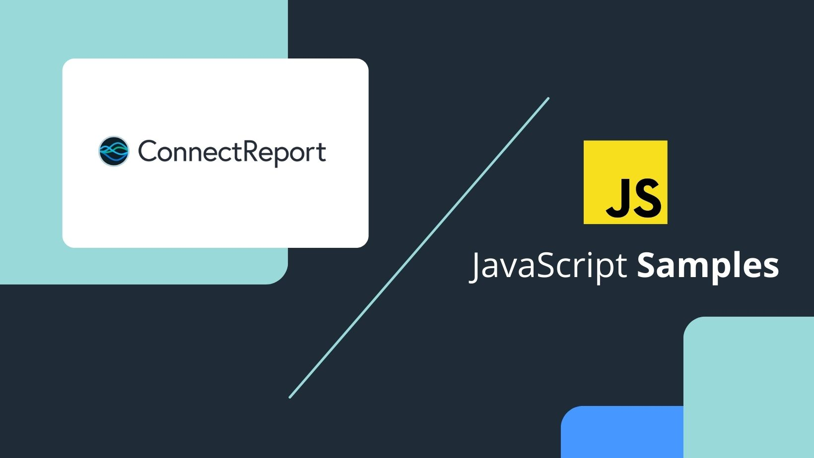

# ConnectReport JavaScript Samples
This repository holds samples to get you up and running with the [ConnectReport JavaScript API client](https://connectreport.com/docs/index.html.)



## Table of contents 
- [Browser samples](/samples/browser) 
  - [Base Template Download](samples/browser/base-template-download) 

## Run the samples 
You can run the browser samples as [directed here](/samples/browser). 

## How to install the API:
From NPM:
```
npm install @connectreport/connectreport.js 
```

From the CDN (latest): 

```
<script src="https://connectreport.com/docs/assets/latest/connectreport.js"></script>
```

From the CDN (version pinned): 

```
<script src="https://connectreport.com/docs/assets/2.39.2/connectreport.js"></script>
```

## About ConnectReport
[ConnectReport](https://connectreport.com) offers a developer-first platform with rich APIs and extensibility that customers rely on to power advanced reporting with less code. 